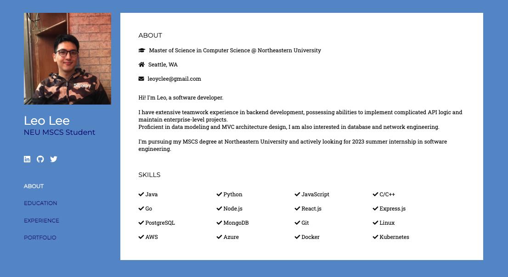
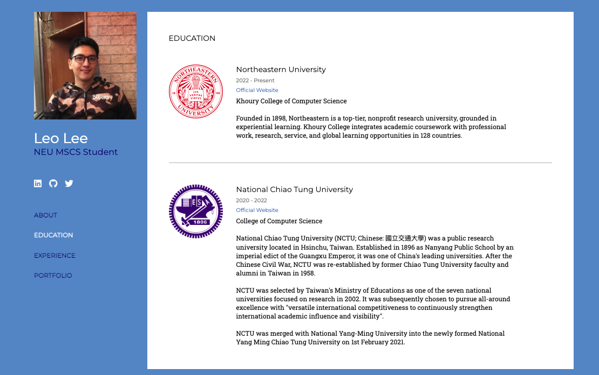
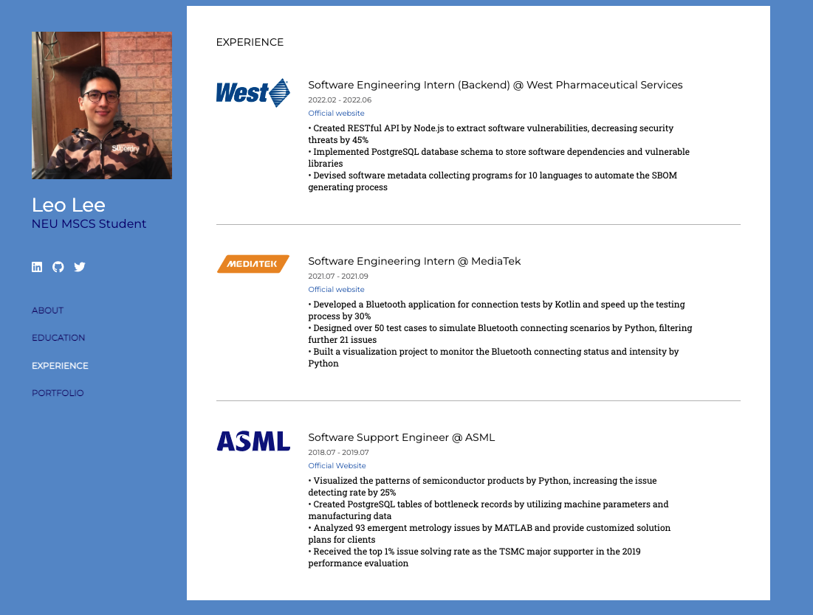
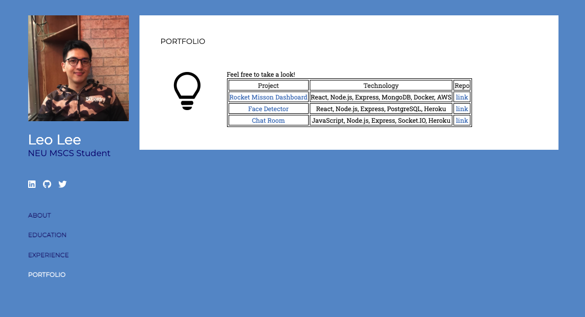
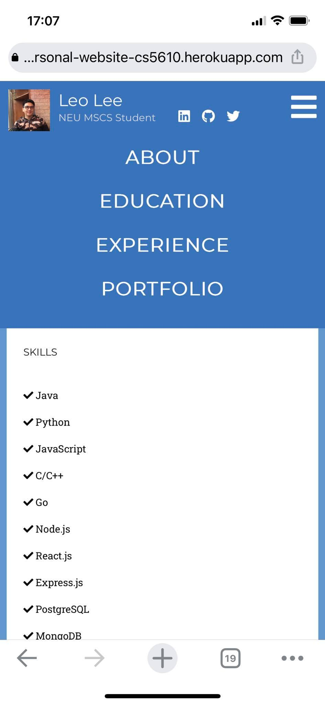

# Personal Website (CS 5610 Project 1)

[Website Link](https://personal-website-cs5610.herokuapp.com/)  
This project is my personal website and was built by HTML, CSS, javascripts, and jQuery.  
With the sidebar manu on the left of the main page, visitors can navigate my education, experience, and portfolio pages.

## Page Screenshot

- Landing page

- Education page

- Experience page

- Portfolio page

## Project Requirements

✅ 1. A landing page (`index.html`): The initial page is also the "ABOUT" page, and visitors can navigate to other pages by the left sidebar.

✅ 2. Navigational elements: The sidebar styled by CSS can guide the user to navigate between pages, and it will become a toggle button when the size of window is smaller than 1000px width (ex: mobile view). By clicking the button, the page options will show up. Hence, the user doesn't need to resort to the browser's navigation buttons to change the page.

✅ 3. Internal links: The sidebar contains "ABOUT", "EDUCATION", "EXPERIENCE", and "PORTFOLIO" links. Each page is a `.html` file, and the content can be opened in the same browser tab as the site is being viewed in.

✅ 4. External links: Under the profile picture, the user can find my personal LinkedIn, Github, and Twitter link. The user can click to open the external link in a new tab.

✅ 5. At least one HTML table with CSS styling: When the user navigates to "PORTFOLIO" page, there is a table containing my previous projects. I used the HTML table syntax to organize my projects to clearly show the project name, technology used, and the repository link. I also used CSS to adjust the border width, color, and the text alignment.  

✅ 6. At least one interactive or animated component: I used jQuery to load the sidebar menu when the landing page was loaded, and make the toggle button possess the click and pop out features when the user want to see page options. I also used CSS to give images a rotated animation (like the logo of schools and companies), and make the font size change when the cursor move on to the page options.

✅ 7. Responsiveness: I already used my phone and tablet to check the website can work on mobile devices.

